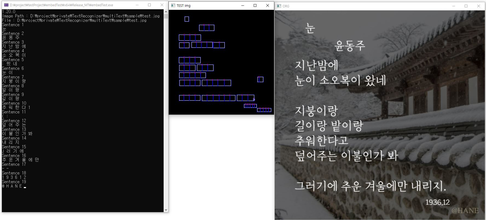
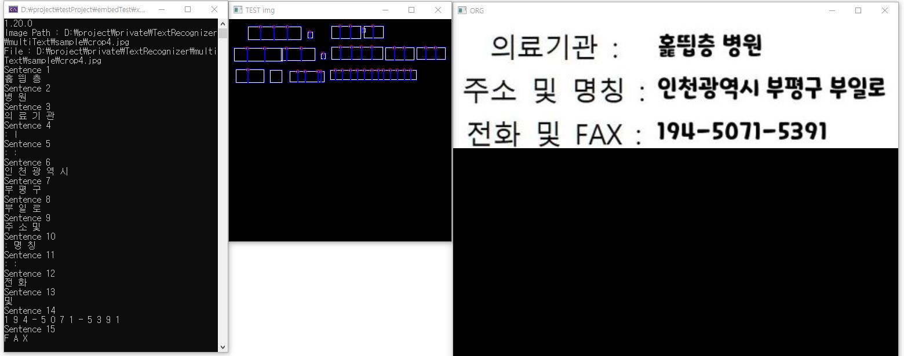

### 개요

python을 통한 모델링 및 트레이닝 후 해당 모델을 c++로 배포합니다.

OCR은 배경 유무 및 노이즈에 상관 없는 인식률을 목표로, 배포는 weight 파일 공개 없이 dll 혹은 exe형식은 단일 파일로 배포하는것을 목표로 만들었습니다.


### 인식 흐름도
```mermaid
graph TD;
    A(이미지 입력)-->B(문자 탐색);
    B-->C(문자 인식);
    C-->R1(0)
    C-->R2(1)
    C-->R3(A)
    C-->R4(@)
    C-->R5(...)
    C-->R6(한글)
    R1-->D{if result == 한글}
    R2-->D
    R3-->D
    R4-->D
    R5-->D
    R6-->D
    D-->|NO|DR1(return)
    D-->|YES|DR2(한글 문자 인식)
    DR2-->F(return)


```

## 학습데이터

synthtiger : 폰트 440여개(https://github.com/clovaai/synthtiger)  
aihub  다양한 형태의 한글 문자 OCR(https://www.aihub.or.kr/aihubdata/data/view.do?currMenu=&topMenu=&aihubDataSe=data&dataSetSn=91)

## c++ 사용 라이브러리

|IDX|  name | url |
|:---|:---|:--|
|1| opencv==4.90	| 
|2| onnxruntime==1.20		| 
|3| spdlog	| 
|4| cxxopts	| 


## 결과





# 사용법
cmd 창을 열어 ./embedTest.exe 를 입력 합니다.

뒤에 인식 옵션을 입력 후 --imagePath 에 원하는 이미지 파일 혹은 해당 디렉토리를 입력합니다.

-t 여러 문자가 있는 이미지  
-m 한글자 이미지에서 한글과 아스키 문자 인식  
-h 한글자 이미지에서 한글 인식  
옵션 없음 : 한글자 이미지에서 아스키 문자 인식


```
// ./embedTest.exe --imagePath D:\project\private\TextRecognizer\SingleChar\0
// ./embedTest.exe -h --imagePath D:\project\private\TextRecognizer\SingleChar\0
// ./embedTest.exe -m --imagePath D:\project\private\TextRecognizer\SingleChar\0
// ./embedTest.exe -t --imagePath D:\project\private\TextRecognizer\multiText\sample

```